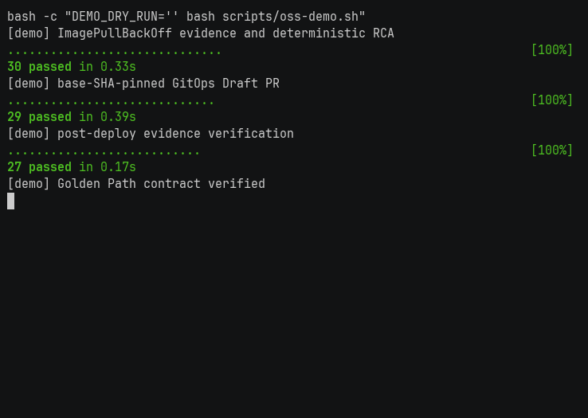
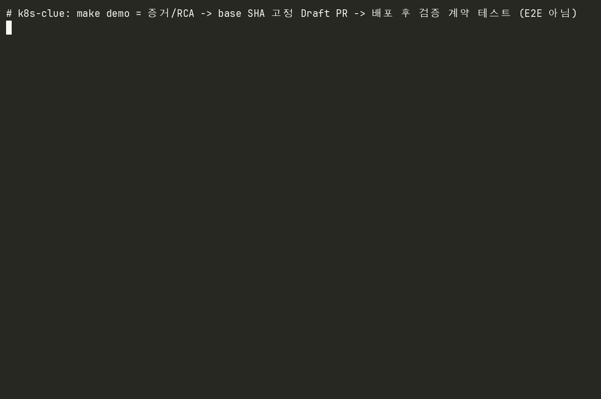

# 🔎 k8s-clue-python-reference — Kubernetes 장애 증거 → 안전한 복구 제안

Kubernetes 장애의 증거를 보존하고 규칙 기반 RCA로 원인을 판정한 뒤, **허용된 GitOps 변경만 사람이 승인하는 GitHub Draft PR로 제안**하는 Python 참조 구현입니다. 자동 복구가 아니라 "사람이 승인하기 직전까지"를 안전하게 자동화하려고 만들었습니다.



## 버전업된 모습

팀 프로젝트가 끝난 뒤 기능을 넓히는 대신 **Golden Path 하나(ImagePullBackOff)로 좁히고 안전 경계를 계약 테스트로 고정**하는 쪽을 택했습니다. 장애 대응 도구에서 가장 위험한 것은 못 고치는 것이 아니라 잘못 고치는 것이라고 봤기 때문입니다.

어려웠던 것은 "LLM에게 판단을 맡기지 않는다"는 선을 코드로 강제하는 일이었습니다. 원인 판정을 versioned rule로 만들면 결정론적이지만 규칙 밖 장애에서는 아무 말도 못 합니다. 그 경우 그럴듯한 추측을 내놓는 대신 **실패 단계와 reason code, 원본 evidence reference를 남기고 멈추도록** 했습니다. 마찬가지로 변경 제안도 Deployment의 scalar 필드 allowlist 밖이면 거부합니다. 기능은 줄었지만 "이 도구가 절대 하지 않는 일"을 테스트로 말할 수 있게 됐습니다.

또 하나는 Draft PR의 base SHA 경쟁 조건이었습니다. 증거 수집 시점과 PR 생성 시점 사이에 대상 브랜치가 움직이면 엉뚱한 기준에 패치가 얹힙니다. **PR 생성 직전에 base SHA를 재확인**하고, 그 사이 진행됐으면 실패로 처리하되 원본 evidence reference는 잃지 않도록 고쳤습니다.

정리 중 대표 명령으로 문서에 적어 둔 `make demo`가 **존재하지 않는 테스트 파일을 가리켜 실행되지 않는 상태**인 것도 발견해 고쳤습니다(아래 "개인 확장").

| 항목 | 정리 전 | 정리 후 |
|---|---|---|
| 완결 보장 시나리오 | 여러 경로가 부분 구현 | ImagePullBackOff **1개를 계약 테스트로 고정** |
| `make demo` | 실행 실패 (없는 파일 참조) | **86개 계약 테스트 통과** |
| 전체 테스트 | — | **205개 통과** |

## 구동모습

`make demo`가 증거·RCA → base SHA 고정 Draft PR → 배포 후 증거 비교의 계약을 순서대로 검증합니다.



`make demo`는 **계약 테스트를 순서대로 실행**합니다. 실제 클러스터에 장애를 만들거나 GitHub에 PR을 발행하는 E2E 데모가 아닙니다.

## 메인 기술

- **읽기 전용 증거 수집 agent** — 대상 클러스터에서 Pod·Event를 읽기만 하고 쓰기 경로를 갖지 않습니다. 계약 테스트가 surface가 read-only임을 검사합니다. → [`evidence/collector.py`](src/services/target/cluster-agent/evidence/collector.py)
- **사건 동일성과 중복 억제** — 같은 장애가 반복 수집돼도 durable unique identity로 한 사건으로 묶습니다. → [`domains/rca/models.py`](src/domains/rca/models.py)
- **결정론적 versioned rule RCA** — `wrong_image_tag` 같은 규칙에 버전을 붙여 같은 증거에 같은 판정이 나오게 합니다. LLM 추론으로 원인을 만들어내지 않습니다. → [`pipeline/causes.py`](src/services/ai/agent/pipeline/causes.py)
- **allowlist 기반 제한 패치** — Deployment의 허용된 scalar 필드만 바꿉니다. 다른 리소스 종류·미승인 필드는 거부합니다. → [`domains/gitops/source_patch.py`](src/domains/gitops/source_patch.py)
- **base SHA 재확인 Draft PR** — 생성 직전 base SHA를 다시 읽어 그 사이 브랜치가 움직였으면 실패 처리합니다. provider에 merge 경로 자체가 없습니다. → [`github_provider.py`](src/services/gitops/scm-worker/github_provider.py)
- **배포 후 회복 검증** — 변경 전 기준선과 새 evidence window를 비교해 실제로 회복됐는지 판정합니다. → [`recovery_verification.py`](src/domains/rca/recovery_verification.py)
- **correlation / causation 전파** — worker가 만드는 자식 이벤트가 부모의 correlation·causation id를 물려받아 사건 단위로 추적됩니다. → [`test_golden_path_safety_contracts.py`](tests/test_golden_path_safety_contracts.py)
- **event bus 모드 동등성** — in-process와 NATS 두 모드의 결과가 같은지 별도 스크립트로 검사합니다. → `make event-bus-equivalence`

## 계획

- 실제 kind 클러스터에서 장애 주입 → Draft PR 발행까지의 **E2E를 한 번 통과**시킨다. 현재는 계약 테스트까지만 보장한다.
- 두 번째 Golden Path(CrashLoopBackOff 또는 OOMKilled)를 같은 안전 계약 위에 올린다.
- 계획된 `clue diagnose` CLI를 실제 진입점으로 만든다. 현재 실행 경로는 Make 타깃이다.
- 규칙 밖 장애에서 **증거 요약만** 제시하는 보조 경로를 검토한다(원인 판정은 계속 규칙에만 맡긴다).
- 저장·통신 호환 때문에 남아 있는 `kyro`/`KYRO` 식별자의 마이그레이션 경로를 정한다.

## 링크

- [Golden Path 안전 계약](docs/GOLDEN-PATH.md)
- [Python 선행 정리 계획 (Java 인수 조건)](docs/PYTHON-FIRST-PLAN.md)
- [Project Map — runtime·route·디렉터리 책임](docs/PROJECT-MAP.md)
- Clue 제품 설계 저장소 — `woonyong-choi/clue` (코드 없는 설계 문서, **비공개**)
- [CI 실행 기록](https://github.com/woonyong-choi/k8s-clue-python-reference/actions)

## 담당

**크래프톤 정글 팀 과제(원본: [minmings111/Kyro-jungle-final](https://github.com/minmings111/Kyro-jungle-final))에서 시작했고, 종료 후 개인 저장소에서 계속 수정·학습·확장하고 있습니다.**

| 항목 | 내용 |
|---|---|
| 원본 팀 저장소 | [minmings111/Kyro-jungle-final](https://github.com/minmings111/Kyro-jungle-final) |
| 팀 과제 기간 | 2026-08-04 ~ 2026-08-17 |
| 팀 구성 | 5인 |
| **본인 담당** | **팀장. 전체 아키텍처, 장애 파이프라인, 서비스 간 인터페이스 설계** |

이 저장소는 팀 프로젝트의 Python 구현을 참조 구현으로 정리한 것입니다. 팀 코드 전체를 개인 구현으로 주장하지 않으며, 기여는 해당 코드와 변경 이력으로 구분합니다.

### 개인 확장 (팀 과제 종료 후)

**커밋 범위: [`b749f3b`](https://github.com/woonyong-choi/k8s-clue-python-reference/commit/b749f3b) (2026-08-04) ~ [`2e02605`](https://github.com/woonyong-choi/k8s-clue-python-reference/commit/2e02605) (2026-09-11).** 기록된 팀 기준선은 [`b749f3b`](https://github.com/woonyong-choi/k8s-clue-python-reference/commit/b749f3b)(첫 커밋)부터 [`e1a9c79`](https://github.com/woonyong-choi/k8s-clue-python-reference/commit/e1a9c79)(2026-08-17, 마지막 확인 커밋)까지이며, 그 이후가 종료 후 개인 작업입니다.[^authors]

| 무엇이 달라졌나 | 커밋 |
|---|---|
| requirements 재현성 고정, OpenTelemetry 정렬, CI 게이트 도입 | [`e1a9c79`](https://github.com/woonyong-choi/k8s-clue-python-reference/commit/e1a9c79) |
| event bus 모드(in-process / NATS) 검증과 생성을 분리 | [`a8219c3`](https://github.com/woonyong-choi/k8s-clue-python-reference/commit/a8219c3) |
| 제품명 전환에 맞춘 식별자 정리 (Opsia → Kyro → Clue), 저장·통신 호환 식별자는 유지 | [`ff2e8c9`](https://github.com/woonyong-choi/k8s-clue-python-reference/commit/ff2e8c9), [`778e1e8`](https://github.com/woonyong-choi/k8s-clue-python-reference/commit/778e1e8) |
| Golden Path로 범위를 좁히고 권한·실패·복구 경계를 감사 | [`c9233d3`](https://github.com/woonyong-choi/k8s-clue-python-reference/commit/c9233d3), [`2e02605`](https://github.com/woonyong-choi/k8s-clue-python-reference/commit/2e02605) |
| **`make demo` 복구** — 없는 `tests/test_incident_alert_event.py`를 가리켜 실행 실패하던 것을 실제 Golden Path 계약 테스트로 교체 | 이번 정리 |

## 구동방법

Python 3.13과 [uv](https://docs.astral.sh/uv/getting-started/installation/)가 필요합니다.

```bash
git clone https://github.com/woonyong-choi/k8s-clue-python-reference.git
cd k8s-clue-python-reference
uv sync --all-groups
make demo
```

```bash
make test            # backend lint + pytest
make doctor          # 로컬 도구 확인
make gate-frontend   # frontend 확인 (Node.js 22 필요)
make manifest-check  # Helm·Kubernetes manifest 검증 (Helm 필요)
make help            # 전체 타깃 목록
```

Docker·kubectl·kind는 이미지·클러스터 검증에 씁니다. 전체 도구를 설치하기 전에 필요한 실행 범위를 `make doctor`와 [문서 목차](docs/README.md)에서 확인합니다.

## 스펙

| 구분 | 내용 |
|---|---|
| 백엔드 언어 | Python 3.13 |
| 패키지·잠금 | uv (`uv.lock`), ruff (lint·format), pytest |
| 백엔드 주요 라이브러리 | FastAPI + Uvicorn, SQLAlchemy 2.0 + Alembic, OpenTelemetry(API·SDK·OTLP), psycopg 3, PyJWT, cryptography |
| 메시징 | in-process event bus / NATS (`nats-py`, 두 모드 동등성 검사) |
| 저장소 | PostgreSQL (outbox·ledger·DLQ), Redis |
| 프론트엔드 | `clue-console` — React 19, Vite, TypeScript, Vitest (Node.js 22) |
| 배포 | Helm chart [`charts/clue`](charts/clue/), 컨테이너 이미지 |
| 라이선스 | Apache-2.0 ([`NOTICE`](NOTICE) — upstream Radar에서 상당 부분 재작성) |

## 검증

[](https://github.com/woonyong-choi/k8s-clue-python-reference/actions/workflows/ci.yml)

**전체 205개 테스트 통과**, **`make demo` 계약 86개 통과**입니다(2026-09-22 로컬 재실행).[^tests]

| 검사 | 결과 | 명령 |
|---|---:|---|
| 전체 pytest | **205 passed** | `make test` |
| demo — ImagePullBackOff 증거·RCA | 30 passed | `make demo` |
| demo — base SHA 고정 Draft PR | 29 passed | `make demo` |
| demo — 배포 후 증거 검증 | 27 passed | `make demo` |
| ruff lint | 통과 | `make test` |
| requirements 재현성 (lock ↔ requirements.txt) | 일치 | `make test` |

```bash
make test                     # 205개 테스트 + lint + lock 일치 검사
make demo                     # Golden Path 계약 86개
make gate-backend             # CI backend job과 동일 (test + manifest-check)
make event-bus-equivalence    # in-process ↔ NATS 결과 동등성
```

CI는 backend(`make gate-backend`)와 frontend(`npm run check`) 두 job으로 나뉘어 있습니다.

### 현재 상태와 한계

완결 시나리오는 **ImagePullBackOff 하나**입니다. 실제 사용자·운영 트래픽, 외부 클러스터와 GitHub App의 E2E는 **미검증**입니다. `clue diagnose`는 계획된 CLI이고 현재 실행 진입점은 Make 타깃입니다. 자동 merge·클러스터 직접 변경·자동 rollback은 하지 않습니다.

기존 암호문·cursor·DB·event·환경변수의 `kyro`/`KYRO` 식별자는 저장·통신 호환 때문에 유지합니다. 이름 변경만으로 기존 Helm release·PVC·DB가 이전되지는 않습니다.

## 참고자료

- [Golden Path 안전 계약](docs/GOLDEN-PATH.md) · [Python 선행 정리 계획](docs/PYTHON-FIRST-PLAN.md) · [Project Map](docs/PROJECT-MAP.md)
- [원본 팀 저장소 minmings111/Kyro-jungle-final](https://github.com/minmings111/Kyro-jungle-final)
- [`NOTICE`](NOTICE) — upstream [skyhook-io/radar](https://github.com/skyhook-io/radar) 출처와 재작성 범위
- [Kubernetes 공식 문서 — Pod lifecycle·Events](https://kubernetes.io/docs/concepts/workloads/pods/pod-lifecycle/)
- [GitHub REST API — Pulls](https://docs.github.com/en/rest/pulls/pulls)

[^authors]: `git log --author='woonyong' --reverse --format='%h %ad %s' --date=short`. 팀 기준선 `b749f3b`~`e1a9c79`는 프로젝트 기록 기준입니다.
[^tests]: `make test`의 pytest 합계와 `make demo`의 장면별 pytest 합계(30+29+27).
