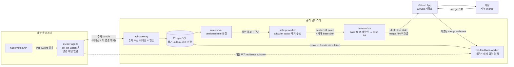

# K8s Clue — Kubernetes 장애 진단과 Draft PR 제안

Kubernetes 장애 증거를 읽기 전용으로 수집하고, 버전이 붙은 규칙으로 원인을 판정한 뒤, 허용된 GitOps 변경만 GitHub Draft PR로 제안하는 Python 팀 프로젝트입니다.

- 5인 팀의 팀장으로 전체 아키텍처, 이벤트 런타임, 서비스 간 계약, CI와 배포를 맡았습니다. 룰 카탈로그, 에이전트 수집, PR 생성, 게이트웨이 인증은 팀원이 작성했습니다.
- 클러스터를 직접 변경하거나 PR을 자동 merge하지 않습니다. 증거와 허용 필드를 확인하고, 사람이 검토할 Draft PR까지만 생성합니다.
- 공개 정리본은 ImagePullBackOff 한 경로를 kind와 계약 테스트 86개로 확인했습니다. 전체 pytest는 294개이며, 외부 클러스터·GitHub App 연동 E2E는 아직 검증하지 않았습니다.

RCA 룰은 합성 입력 116개(장애 87 + 정상 29)에서 가려진 후보 0건·오탐 0건을 기록했습니다. 이 수치는 2026-09-23 로컬 재실행 결과이며 실사용 트래픽 지표가 아닙니다.

[](https://github.com/woonyong-choi/k8s-clue/actions/workflows/ci.yml)


크래프톤 정글 팀 과제(원본 [minmings111/Kyro-jungle-final](https://github.com/minmings111/Kyro-jungle-final))에서 시작해, 과제 종료 후 개인 포크에서 Golden Path와 안전 계약을 정리했습니다. 커밋 단위 경계는 [팀 과제와 개인 확장의 경계](docs/personal-extension.md)에 있습니다.

## 데모

`make demo`는 kind 클러스터에서 ImagePullBackOff를 실제로 재현한 뒤, 증거·RCA → base SHA 고정 Draft PR → 배포 후 검증 계약을 순서대로 검사합니다. 실제 GitHub에 PR을 발행하는 E2E는 아닙니다.


위는 `DEMO_SKIP_PR=1 DEMO_KIND_CONTEXT=kind-clue-demo bash scripts/demo_terminal.sh`의 실제 실행 기록입니다. kind에 없는 image tag를 쓰는 Deployment를 띄워 `ErrImagePull`을 관측하고, 네 장면의 계약 테스트 86건을 통과한 뒤, Draft PR 수명주기 계약 테스트 이름 일부를 보여 줍니다.

## 빠르게 실행하기

Python 3.13과 [uv](https://docs.astral.sh/uv/getting-started/installation/)가 필요합니다. 카탈로그 계층 테스트에는 Docker(PostgreSQL 하나)가 추가로 필요합니다.

```bash
git clone https://github.com/woonyong-choi/k8s-clue.git && cd k8s-clue
uv sync --all-groups
make demo          # Golden Path 계약 86개
make catalog-up && make catalog-schema   # 카탈로그 검사용 PostgreSQL
make test          # ruff lint + pytest 294개
```

`make demo`는 `DEMO_KIND_CONTEXT`가 없으면 kind 장면을 건너뛰고 계약 테스트만 실행합니다. 전체 타깃은 `make help`, 로컬 도구 확인은 `make doctor`로 봅니다.

## 구조

```
src/services/target/cluster-agent/   읽기 전용 증거 수집 (get·list·watch만)
src/services/ai/                     RCA·계획·복구 워커 10개
src/services/gitops/                 safe-pr-worker(패치 구성) · scm-worker(Draft PR)
src/services/gateway/                api-gateway(증거 수신) · outbox-relay(발행)
src/domains/                         gitops·rca·inventory·datacatalog 도메인 규칙
src/packages/                        event bus · outbox · 처리 원장 · 보안
charts/clue/                         Helm chart (agent RBAC은 read-only만)
evals/                               RCA 룰 골든셋과 실측 결과
tests/                               계약·속성·카탈로그 테스트 294개
```

`uv run python scripts/services.py`가 16개 runtime 서비스를 출력합니다.


```mermaid
flowchart LR
  subgraph T["대상 클러스터"]
    K["Kubernetes API"]
    A["cluster-agent<br/>get·list·watch만<br/>명령 채널 없음"]
  end
  subgraph M["관리 클러스터"]
    GW["api-gateway<br/>증거 수신·에이전트 인증"]
    DB[("PostgreSQL<br/>증거·outbox·처리 원장")]
    RCA["rca-worker<br/>versioned rule 판정"]
    SPR["safe-pr-worker<br/>allowlist scalar 패치 구성"]
    SCM["scm-worker<br/>base SHA 재확인 → Draft PR"]
    VER["rca-feedback-worker<br/>기준선 대비 회복 검증"]
  end
  GH["GitHub App<br/>GitOps 저장소"]
  P["사람<br/>리뷰·merge"]

  K -->|"Pod·Event 읽기"| A
  A -->|"증거 bundle<br/>(에이전트가 연결 개시)"| GW
  GW --> DB
  DB --> RCA
  RCA -->|"원인 후보 + 근거"| SPR
  SPR -->|"scalar 1개 patch<br/>+ 기대 base SHA"| SCM
  SCM -->|"draft: true 강제<br/>merge API 미호출"| GH
  GH --> P
  P -->|"merge 결정"| GH
  GH -->|"서명된 merge webhook"| VER
  A -.->|"다음 주기 evidence window"| VER
  VER -->|"resolved / verification failed"| DB
```

설계 문서: [설계 근거 — 버린 대안과 알려진 한계](docs/design.md) · [Golden Path 안전 계약 9개 조항](docs/GOLDEN-PATH.md) · [Project Map](docs/PROJECT-MAP.md) · [문서 목차](docs/README.md)

## 핵심 결정과 트레이드오프

### 1. YAML을 다시 쓰지 않고 byte span만 갈아끼운다

**문제** — PR로 나가는 것은 사람이 읽고 승인할 diff다. 의도하지 않은 줄이 한 줄이라도 섞이면 리뷰어는 그 PR 전체를 믿을 수 없다.

**선택** — 승인된 원문을 `yaml.compose_all`로 node 트리로 파싱해 대상 `ScalarNode`의 `start_mark ~ end_mark` 구간만 문자열 치환하고, 치환 후 다시 파싱해 승인 범위 밖이 움직였으면 패치를 버린다.

**버린 대안** — `ruamel.yaml` round-trip 덤프는 코드가 훨씬 적지만 인용 방식·빈 줄·flow 스타일·긴 줄 접힘이 덤퍼 설정에 따라 달라져서 보존이 "어느 정도"에 그친다. kustomize overlay를 얹는 방법은 그 파일이 앞으로 모든 필드를 덮어쓸 수 있는 자리가 되어, "Deployment의 허용된 scalar만"이라는 제약이 파일 구조가 아니라 사람의 규율에 의존하게 된다.

**근거** — [`domains/gitops/source_patch.py`](src/domains/gitops/source_patch.py) · 속성 테스트 [`test_source_patch_splice_properties.py`](tests/test_source_patch_splice_properties.py)가 들여쓰기·주석·인용 방식을 바꿔 가며 ① 정확히 한 줄만 움직이고 ② 주석 수가 보존되고 ③ rollback이 원문을 byte 단위로 복원하는지 검사한다.

### 2. 원인 판정을 LLM이 아니라 versioned rule로 한다

**문제** — 판정이 비결정적이면 같은 증거에 어제와 오늘 다른 답이 나오고, "왜 이 PR이 생겼는가"를 사후에 재구성할 수 없다.

**선택** — YAML 룰 카탈로그(29 rule / 87 candidate)로만 판정한다. 규칙 밖이면 그럴듯한 추측 대신 실패 단계·reason code·원본 evidence reference를 남기고 멈춘다. 소스 존재만으로 점수가 1.0이 되던 오판은 판별 신호를 분모에 넣어 막았고, 점수 동률이면 판별 신호를 더 많이 충족한 후보를 고른다.

**버린 대안** — LLM에게 원인을 묻는 경로는 재현되지 않아 승인 절차의 입력이 될 수 없다(`CauseCandidate.source`에 `ai_fallback` 자리만 남겨 두었다). 룰을 파이썬 코드로만 쓰는 초기 구현은 시나리오 하나 추가에 코드 리뷰가 필요하고 룰 전체를 한눈에 비교할 수 없어 버렸다.

**근거** — [`services/ai/agent/causes/engine.py`](src/services/ai/agent/causes/engine.py) · `make rca-eval`이 116개 시나리오에서 accuracy 87/87, 오탐 0/29, confusion pair 0을 실측한다([evals/results.md](evals/results.md)). 골든셋은 카탈로그를 역산한 합성 입력이므로 이 100%는 "정확하다"가 아니라 **"어떤 후보도 가려져 있지 않다"**는 뜻이다.

### 3. PR 생성 직전에 base SHA를 다시 읽는다

**문제** — 증거 수집 시점과 PR 생성 시점 사이에 대상 브랜치가 움직이면 엉뚱한 기준에 패치가 얹힌다.

**선택** — branch·file 준비를 끝낸 뒤 base ref를 다시 읽어 처음 검증한 SHA와 다르면 PR POST 전에 중단한다. 실패로 처리하되 원본 evidence reference는 잃지 않는다. provider에 merge API 호출 경로 자체가 없고, `draft: true`가 아닌 응답은 거부한다.

**버린 대안** — 수집 시점 SHA를 그대로 신뢰하고 GitHub의 충돌 처리에 맡기는 방법. GitHub은 base가 전진해도 PR을 만들어 주므로, 잘못된 기준 위의 patch가 조용히 리뷰로 넘어간다.

**근거** — [`services/gitops/scm-worker/github_provider.py`](src/services/gitops/scm-worker/github_provider.py) · [`test_safe_pr_structured_base_advance.py`](tests/test_safe_pr_structured_base_advance.py)(12건) · [`test_recovery_pr_lifecycle.py`](tests/test_recovery_pr_lifecycle.py)(17건)

### 4. "이번에 안 보였다"를 "지워졌다"로 읽지 않는다

**문제** — 에이전트는 전체 클러스터가 아니라 namespace 단위 cut만 수집할 수 있다. 수집이 잘렸거나 label selector로 좁혀졌는데 스냅샷에 없는 리소스를 삭제로 처리하면, 살아 있는 리소스가 대량으로 deleted로 표시된다 — 되돌리기 가장 어려운 실패다.

**선택** — 삭제 권한을 범위 단위로 발급한다. `observed ∧ complete ∧ delete_safe ∧ ¬truncated ∧ selector 없음 ∧ reason code 없음`인 collection에서만 `(resource_type, namespace)` 범위를 내준다. Event는 보존 기간이 지나면 사라지므로 어떤 조건에서도 삭제 권한을 얻지 못한다.

**버린 대안** — "수집이 완전할 때만 삭제한다"는 더 단순하고 지금도 fallback으로 남아 있다. 버린 것은 아니고 그 위에 범위 삭제를 얹었다. 큰 클러스터에서 전체 수집이 매번 완전하기를 기대할 수 없어 inventory가 영원히 늙은 행을 들게 되기 때문이다.

**근거** — [`domains/inventory/coverage.py`](src/domains/inventory/coverage.py) · 속성 테스트 [`test_inventory_delete_scope_properties.py`](tests/test_inventory_delete_scope_properties.py). 다만 투영 단계가 아직 연결돼 있지 않아 런타임에서는 항상 빈 범위를 돌려준다(아래 [범위와 한계](#범위와-한계)).

### 5. 권한 검사를 소스가 아니라 렌더링 결과에 건다

**문제** — 에이전트에 read-only 권한만 부여해도, 차트가 조건 분기로 만들어 내는 최종 manifest가 실제로 클러스터에 적용된다.

**선택** — Helm으로 렌더링한 manifest 전체를 검사해 `get`/`list`/`watch` 밖의 verb, `pods/exec`·`pods/attach`·`pods/portforward`·`nodes/proxy`, wildcard(`*`)가 하나라도 있으면 CI를 중단시킨다.

**버린 대안** — 차트 소스의 `rules:` 블록만 문자열로 검사하는 방법. 조건 분기와 값 오버라이드로 생기는 최종 결과를 보지 못한다.

**근거** — [`scripts/manifest-check.sh`](scripts/manifest-check.sh)(렌더된 Kubernetes object 11개 검사) · [`test_agent_kubernetes_surface_is_read_only`](tests/test_golden_path_safety_contracts.py) · CI `backend` job이 `make gate-backend`로 함께 돌린다.

## 검증

| 스위트 | 무엇을 증명하나 | 개수 | 실행 명령 |
|---|---|---:|---|
| 전체 pytest | lint + 전 계층 회귀 (PostgreSQL 기동 시) | **294 passed** | `make catalog-up && make test` |
| 전체 pytest (DB 없이) | 카탈로그 36개는 skip | 258 passed, 36 skipped | `make test` |
| demo — 증거·RCA | ImagePullBackOff 증거에서 결정론적 원인이 나오는가 | 24 | `make demo` |
| demo — Draft PR | base SHA 고정, draft 강제, merge 경로 부재 | 29 | `make demo` |
| demo — 배포 후 검증 | 기준선 대비 실제 회복 판정, stale window 거부 | 27 | `make demo` |
| demo — Golden Path 안전 계약 | 9개 조항(read-only·correlation·멱등성·allowlist 등) | 6 | `make demo` |
| 속성 테스트 | byte span 치환과 삭제 범위의 불변식 | 6 | `uv run pytest tests/test_source_patch_splice_properties.py tests/test_inventory_delete_scope_properties.py` |
| RCA 룰 실측 | 가려진 후보 / 정상 증거 오탐 | **0 / 0** (116 시나리오) | `make rca-eval` |
| 운영 데이터 카탈로그 | 자산·스키마 계약·리니지·품질 SQL·조회 API | **79 passed** | `make catalog-test` |
| Helm·manifest 검사 | 렌더된 object 11개에 mutation verb·wildcard 없음 | 통과 | `make manifest-check` |
| event bus 모드 동등성 | in-process와 NATS 결과가 같은가 | `equivalent: true` | `make event-bus-equivalence` |
| requirements 재현성 | `uv.lock` ↔ `requirements.txt` | 일치 | `make test` |

CI는 4개 job입니다 — `backend`(`make gate-backend`), `frontend`(`npm run check`), `actionlint`, `demo`. `demo` job은 kind 클러스터를 띄우고 `DEMO_KIND_CONTEXT`를 넘겨, 없는 image tag를 쓰는 Deployment가 실제로 `ImagePullBackOff`에 들어가는지 관측한 뒤 같은 계약 테스트를 실행합니다(`DEMO_SKIP_PR=1`이므로 PR은 발행하지 않습니다).

## 범위와 한계

- 완결 검증한 시나리오는 **ImagePullBackOff 하나**입니다. 룰 카탈로그에는 다른 시나리오도 있지만, 지표·로그 임계치가 필요한 경로는 패치 allowlist와 회복 검증 쪽이 막혀 있습니다.
- **실사용 트래픽·복구 시간·처리량·비용은 측정하지 않았습니다.** 외부 클러스터와 GitHub App의 종단 검증도 미완입니다. 현재 보장 범위는 계약 테스트와 kind 재현까지입니다.
- RCA 골든셋은 카탈로그 YAML을 역산한 **합성 데이터**입니다. accuracy 100%는 실제 장애 정확도가 아니라 "어떤 후보도 가려져 있지 않다"는 뜻입니다.
- **범위 단위 삭제 기능은 사실상 꺼져 있습니다.** 에이전트가 내보내는 `collection_scopes`를 `collection_coverage`로 투영하는 단계가 연결돼 있지 않아 런타임에서 `inventory_deletion_scopes()`는 항상 빈 튜플을 돌려줍니다. 안전한 쪽(아무것도 지우지 않음)으로 닫히지만 기능은 아직 없습니다 — [design.md의 알려진 한계](docs/design.md#알려진-한계-지금-열려-있는-구멍).
- `clue diagnose`는 **계획된 CLI**이고 현재 실행 진입점은 Make 타깃입니다. 저장·통신 호환 때문에 남아 있는 `kyro`/`KYRO` 식별자의 마이그레이션 경로도 아직 정하지 않았습니다.

## 관련 링크

- [설계 근거](docs/design.md) — 왜 이 자료구조인가, 버린 대안, 알려진 한계
- [Golden Path 안전 계약](docs/GOLDEN-PATH.md) — 9개 조항의 코드 강제 지점과 회귀 테스트
- [팀 과제와 개인 확장의 경계](docs/personal-extension.md) — 커밋 범위, 정리 전후, 기술 스펙
- 운영 데이터 카탈로그 — [수집 완전성 계약](docs/collection-contract.md) · [메타데이터 카탈로그](docs/metadata-catalog.md) · [품질 검사 SQL](docs/sql-quality-checks.md) · [조회 API](docs/catalog-api.md)
- [Python 선행 정리 계획](docs/PYTHON-FIRST-PLAN.md) — Java 포팅 인수 조건
- 원본 팀 저장소 — [minmings111/Kyro-jungle-final](https://github.com/minmings111/Kyro-jungle-final) · [팀 발표 영상](https://www.youtube.com/watch?v=Ar4rNJZX7lU)
- [포트폴리오](https://docs.woonyong.com/projects/) · [CI 실행 기록](https://github.com/woonyong-choi/k8s-clue/actions)
- [`NOTICE`](NOTICE) — upstream [skyhook-io/radar](https://github.com/skyhook-io/radar) 출처와 재작성 범위 (Apache-2.0)
- [Kubernetes — Pod lifecycle·Events](https://kubernetes.io/docs/concepts/workloads/pods/pod-lifecycle/) · [GitHub REST API — Pulls](https://docs.github.com/en/rest/pulls/pulls)
